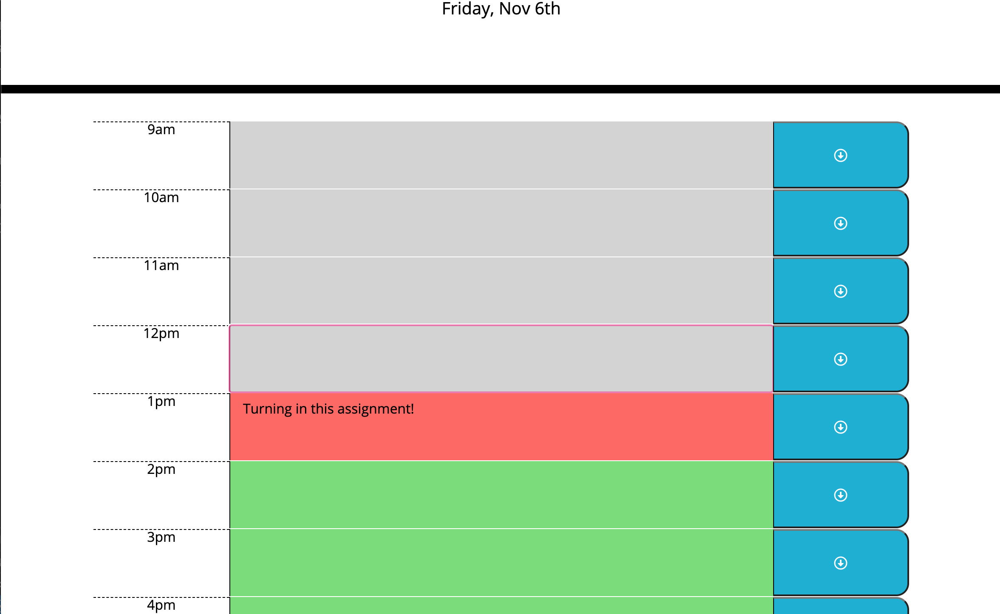

# daily-schedule

## Overview

For this project I was to make a daily work schedule using moment.js and jquery. The shcedule is from 9am to 5pm, a typical work hour for a day and list the new date at the top. I did this by using moment.js and creating a variable to display it in the selected area. I then compared current time with moment.js and schedule times to decide if an hour is in the past it will be gray, if it's in the present it will be red, and if it is in the future it will be green.

I dynamically created HTML using jquery and was able to have the time blocks be for however many hours I wanted to list. Lastly, I made it so that the save icon using Font Awesome would save to that time block whatever the user's event or daily plan they had would save on click.

[Link]()
